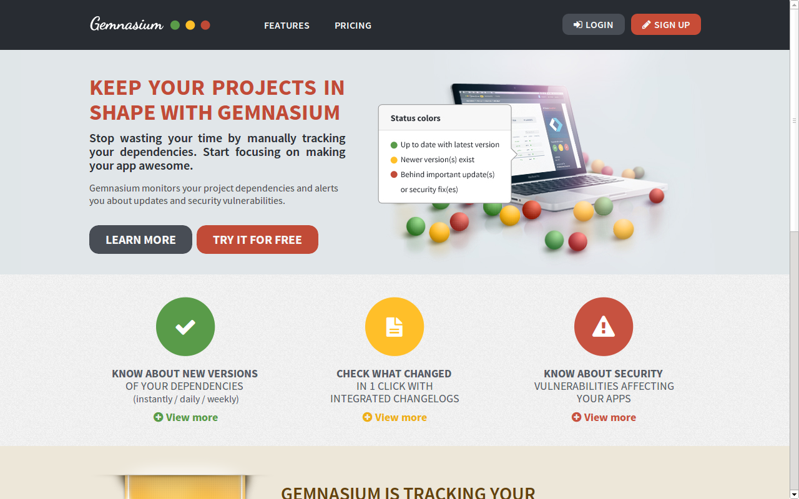
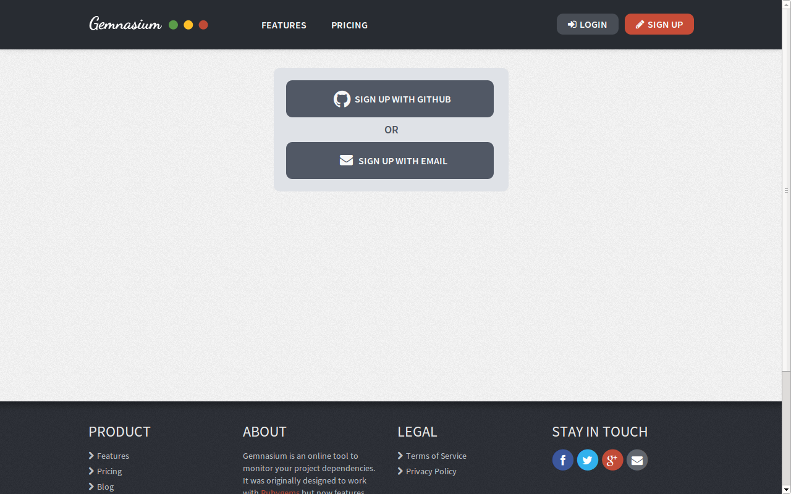
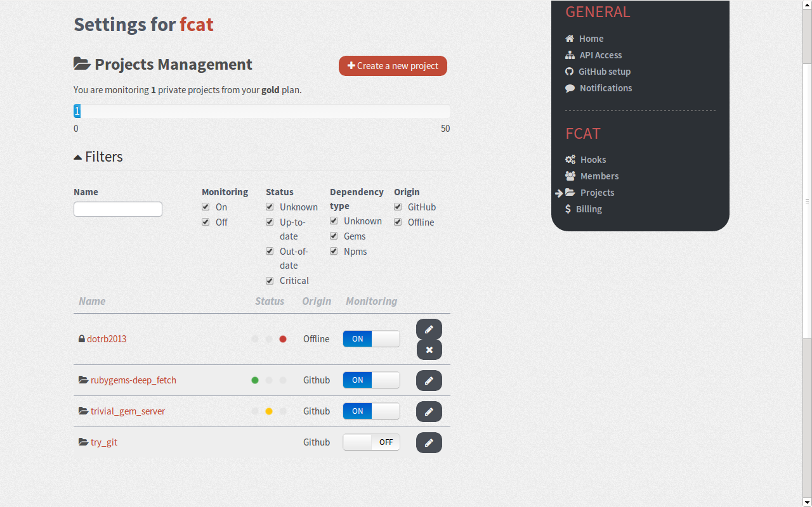
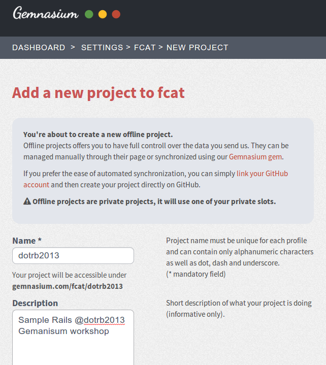
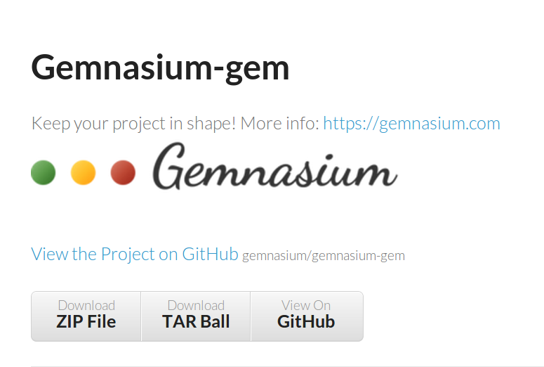
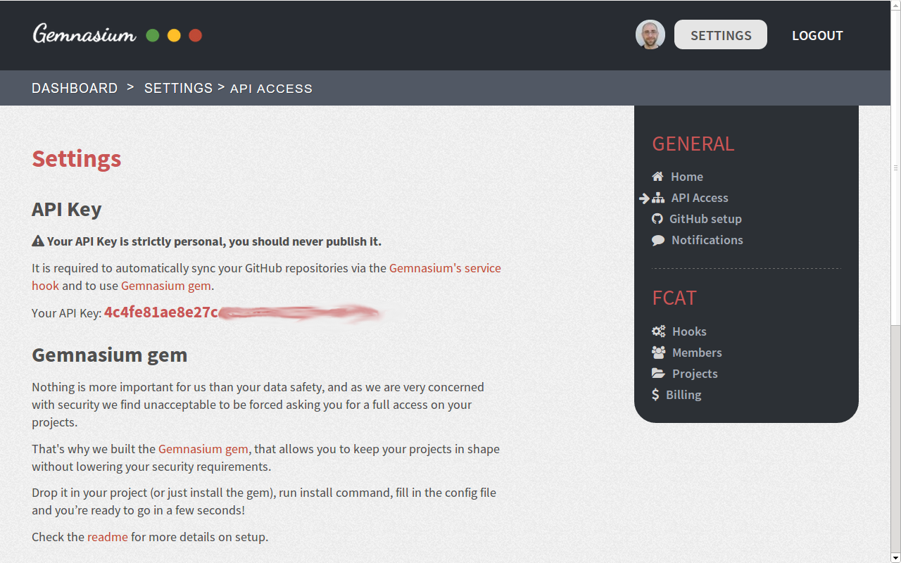

!SLIDE small
# Gemnasium Quickstart

!SLIDE center

!SLIDE center

!SLIDE center

!SLIDE center

!SLIDE
# For GitHub Projects

!SLIDE
# For offline Projects
## (not on GitHub)

!SLIDE center

!SLIDE center

!SLIDE center

!SLIDE small
# create `gemnasium.yml`

!SLIDE small
# run `gemnasium push`

!SLIDE center
# Hands-on
