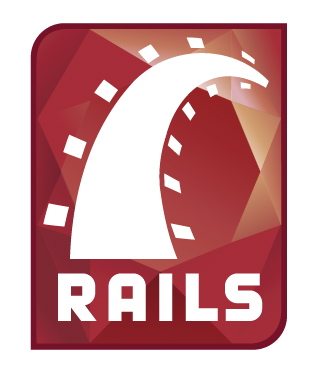

!SLIDE
# Gemnasium Workshop

!SLIDE
# I love Ruby gems!

!SLIDE
# Thousands of gems
.notes Such a great toolbox!

!SLIDE
# New gems everyday

!SLIDE
# And new releases

!SLIDE
# I have to catch up.

!SLIDE
# everyday.

!SLIDE small
# to keep my projects in shape
.notes among other things

!SLIDE
# Along the way...
.notes so this is the topic of this workshop, and along the way...

!SLIDE center

!SLIDE center

!SLIDE center

!SLIDE
# 2 Hands-on sessions

!SLIDE
# [Install with docker](https://gist.github.com/fcat/7027665)
## Hands-on Part 1

!SLIDE small
# [Update the dependencies](https://gist.github.com/fcat/7027970)
## Hands-on Part 2

!SLIDE
# 2 breaks
## about 10 minutes long

!SLIDE
# Agenda
* 9.00 - part 1
* 10.00 - break
* 10.30 - part 2
* 11.00 - break
* 12.00 - conclusion
* 12.15 - end of the workshop

!SLIDE
# Feel confortable.

